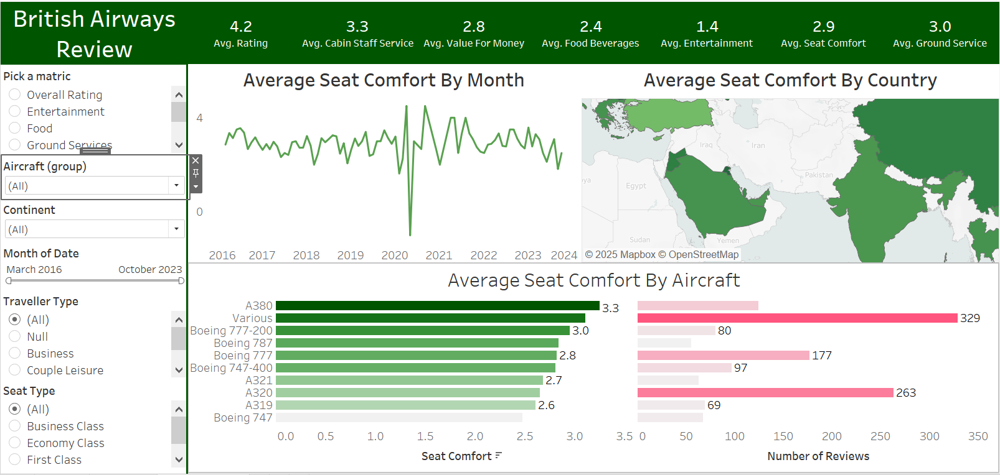

# **British Airways Review Dashboard**

## **Project Overview**

The **British Airways Review Dashboard** is an interactive analytics tool designed to analyze customer reviews and satisfaction metrics for British Airways. The dashboard enables stakeholders to evaluate key aspects of customer experience, such as **seat comfort, cabin staff service, entertainment, food quality, and overall rating**. The goal is to **identify trends, pinpoint areas for improvement, and enhance service quality** based on passenger feedback.

---

## **Business Problems Addressed**

### **Understanding Customer Satisfaction Trends**

- Track overall customer sentiment based on **ratings across multiple categories** (seat comfort, food, entertainment, etc.).
- Identify fluctuations in satisfaction over time and across different aircraft types.

### **Assessing Aircraft Comfort Levels**

- Compare **seat comfort scores** across different aircraft models (e.g., A380, Boeing 777).
- Identify which aircraft have the **highest and lowest comfort ratings**.

### **Geographic Trends in Reviews**

- Analyze **seat comfort ratings by country** to determine regional differences in passenger satisfaction.
- Help British Airways target **specific markets** for service improvement.

### **Tracking Review Volume**

- Identify **which aircraft models receive the most or least reviews**.
- Understand **customer engagement levels** through review count analysis.

### **Detecting Areas for Improvement**

- Highlight **underperforming service areas** (e.g., low ratings for food and entertainment).
- Provide insights for **enhancing in-flight experience and services**.

---

## **Steps Taken in the Analysis**

### **1- Data Preparation**

- Collected and cleaned customer review data to ensure consistency.
- Standardized **date formats and numerical ratings** for analysis.
- Created **mapping for geographic review trends**.

### **2- Data Transformation**

- Built a **calculated field** to allow dynamic metric selection based on user input:

```DAX
CASE [Pick a metric]
    WHEN 'Overall Rating' THEN [Rating]
    WHEN 'Cabin Staff Services' THEN [Cabin Staff Service]
    WHEN 'Entertainment' THEN [Entertainment]
    WHEN 'Food' THEN [Food Beverages]
    WHEN 'Ground Services' THEN [Ground Service]
    WHEN 'Seat Comfort' THEN [Seat Comfort]
    WHEN 'Value' THEN [Value For Money]
END
```

# British Airways Review Dashboard

## Applied Filters

- **Aircraft**
- **Continent**
- **Month**
- **Traveller Type**

These filters enable flexible analysis and deeper insights.

## Generated Insights

- **Time-series trends** for seat comfort ratings.

## 3- Data Modeling

Established relationships between:

- **Aircraft types** and seat comfort ratings.
- **Review data** and time-based trends.
- **Geographic regions** and customer satisfaction.

Optimized calculations in Tableau for **better performance**.

---

## Dashboard Components

### Key Metrics (KPIs)

- **Average Overall Rating**
- **Cabin Staff Service Score**
- **Value for Money**
- **Food & Beverage Score**
- **Entertainment Score**
- **Seat Comfort Score**
- **Ground Service Rating**

### Data Visualizations

#### **Average Seat Comfort by Month**

- Displays trends over time to identify fluctuations in comfort ratings.

#### **Average Seat Comfort by Country**

- Map visualization highlighting regional differences in passenger satisfaction.

#### **Average Seat Comfort by Aircraft**

- Bar chart comparing different aircraft models based on seat comfort ratings.
- **Review volume analysis** to understand customer engagement per aircraft type.

---

## Key Findings & Insights

### Seat Comfort Varies by Aircraft

- **A380** has the highest seat comfort rating (**3.3**).
- **A319 and A320** have lower scores.
- **Recommendation**: Optimize seating configurations for lower-rated aircraft to enhance passenger comfort.

### Service Areas Need Improvement

- **Food & Beverages** (2.4) and **Entertainment** (1.4) received the lowest ratings.
- **Recommendation**: British Airways should focus on enhancing in-flight meals and upgrading entertainment options.

### Regional Trends in Customer Satisfaction

- Some countries report **higher or lower ratings**, indicating potential service disparities.
- **Recommendation**: British Airways can target **low-rated regions** for service enhancements.

### Review Volume Insights

- Some aircraft, like the **Boeing 747 and A380**, receive significantly more reviews.
- **Recommendation**: Airlines can **gather targeted feedback** to improve customer experience on **less-reviewed aircraft**.

---

## Actionable Recommendations

### Enhance In-Flight Services

- Improve **food quality** and expand menu choices.
- Upgrade **entertainment systems** to offer more content options.

### Optimize Seating Experience

- **Reconfigure seating** arrangements on lower-rated aircraft.
- **Conduct passenger surveys** to gather more insights on seat comfort issues.

### Target Regional Service Improvements

- Identify specific **countries with low satisfaction scores** and tailor service improvements accordingly.

### Encourage More Customer Feedback

- **Promote review submissions** to get more data on underrepresented aircraft types.

---

## ✈️ Conclusion

The **British Airways Review Dashboard** provides **valuable insights** into passenger experiences by analyzing customer reviews. This tool helps:

- **Track service quality trends**
- **Identify weak areas**
- **Optimize airline operations** to enhance passenger satisfaction.

By leveraging these insights, **British Airways can make data-driven decisions** to improve **overall customer experience** and **brand reputation**.

---
