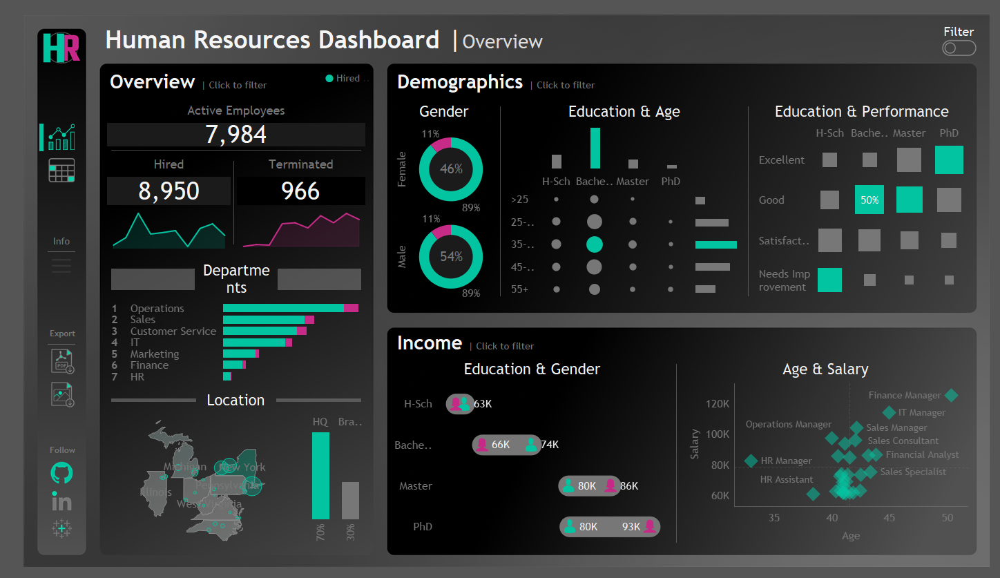

# Human Resources Dashboard

## Project Overview

The **Human Resources Dashboard** provides a detailed analysis of employee statistics, including hiring trends, terminations, demographics, income, and performance. It enables HR professionals to track workforce composition, assess department-wise employee distribution, and analyze salary trends.

## Business Problems Addressed

1. **Employee Tracking** – Identifies the total active employees, hires, and terminations.
2. **Demographic Insights** – Provides gender distribution and employee age trends.
3. **Education & Performance Analysis** – Shows how educational background influences employee performance.
4. **Income Analysis** – Examines salary trends by education level and gender.
5. **Department Analysis** – Highlights employee distribution across departments.
6. **Workforce Longevity** – Calculates employee tenure to understand turnover rates.

---

## Key Metrics & Visuals

### **1. Overview Section**

- **Total Active Employees** – Displays the number of employees currently working.
- **Total Hires & Terminations** – Compares hiring and termination trends.
- **Department-wise Distribution** – Shows employee counts in various departments.
- **Location Breakdown** – Visualizes workforce distribution across different locations.

### **2. Demographics Section**

- **Gender Distribution** – Shows the percentage of male and female employees.
- **Education & Age Trends** – Analyzes employee education levels and age groups.

### **3. Education & Performance Section**

- **Correlation Between Education & Performance** – Determines if employees with higher education perform better.

### **4. Income Analysis**

- **Salary by Education & Gender** – Compares income levels based on qualifications and gender.
- **Age vs. Salary** – Analyzes salary trends based on employee age.
  

---

## Explanation of Calculated Fields

### **1. Employee Status Calculation**

# DAX Measures for HR Analytics

```DAX
1. Employee Status
Employee Status =
IF( ISBLANK( HR[Termdate] ), "Hired", "Terminated" )
Purpose: Categorizes employees as either "Hired" or "Terminated" based on whether they have a termination date.
```

```DAX
2. % Highlight Max Calculation
Highlight Max =
VAR MaxHired = MAXX( ALL( HR ), [% Total Hired] )
RETURN IF( [% Total Hired] = MaxHired, 1, 0 )
Purpose: Highlights the department with the highest hiring percentage.
```

```DAX
3. Percentage of Total Hired
% Total Hired =
DIVIDE( [Total Hired], CALCULATE( [Total Hired], ALL( HR ) ) )
-- Purpose: Computes the proportion of hires in a specific department compared to total hires.
```

```DAX
4. Percentage of Total Terminated
% Total Terminated =
DIVIDE( [Total Terminated], CALCULATE( [Total Terminated], ALL( HR ) ) )
Purpose: Calculates the percentage of terminations in each department.
```

```DAX
5. Employee Age Calculation
Employee Age =
DATEDIFF( HR[Birthdate], TODAY(), YEAR )
Purpose: Determines the current age of an employee.
```

```DAX
6. Maximum Hires Highlight
Max Hired Dept =
VAR MaxHires = MAXX( ALL( HR ), [Total Hired] )
RETURN IF( [Total Hired] = MaxHires, 1, 0 )
Purpose: Identifies the department with the highest number of hires.
```

```DAX
7. Employee Tenure Calculation
Employee Tenure =
IF( ISBLANK( HR[Termdate] ),
DATEDIFF( HR[Hiredate], TODAY(), YEAR ),
DATEDIFF( HR[Hiredate], HR[Termdate], YEAR )
)
Purpose: Calculates the number of years an employee has worked in the company. If the employee is still active, tenure is calculated from the hire date to today.
```

```DAX
8. Top Hired Department (Rank 1)
Rank 1 Department =
IF( RANKX( ALL( HR ), [% Total Hired], , DESC ) = 1, 1, 0 )
Purpose: Identifies the department with the highest hiring percentage.
```

```DAX
9. Second Top Hired Department (Rank 2)
Rank 2 Department =
IF( RANKX( ALL( HR ), [% Total Hired], , DESC ) = 2, 1, 0 )
Purpose: Identifies the department with the second highest hiring percentage.
```

```DAX
10. Total Active Employees Count
Total Active Employees =
CALCULATE( COUNT( HR[Employee ID] ), ISBLANK( HR[Termdate] ) )
Purpose: Counts the number of employees currently working (i.e., those without a termination date).
```

```DAX
11. Total Employees Count
Total Employees =
COUNT( HR[Employee ID] )
Purpose: Counts the total number of employees (both active and terminated).
```

```DAX
12. Total Terminated Employees Count
Total Terminated Employees =
CALCULATE( COUNT( HR[Employee ID] ), NOT( ISBLANK( HR[Termdate] ) ) )
Purpose: Counts the number of employees who have left the company.
```

## Insights & Recommendations

### Retention Strategy

---

If termination rates are high, HR should analyze attrition patterns and implement engagement programs to improve employee satisfaction and retention.

### Salary Adjustments

---

If a gender pay gap exists, HR must review compensation policies to ensure fair and competitive salaries across all levels.

### Performance & Education

---

If highly educated employees underperform, targeted training programs or role adjustments may be necessary to maximize their potential.

### Departmental Hiring Focus

---

Departments with high turnover should refine hiring strategies and enhance employee satisfaction initiatives to improve retention.

---

## Conclusion

The Human Resources Dashboard provides valuable insights into workforce trends, empowering HR teams to optimize hiring, retention, salary structures, and performance management through data-driven strategies. 🚀
