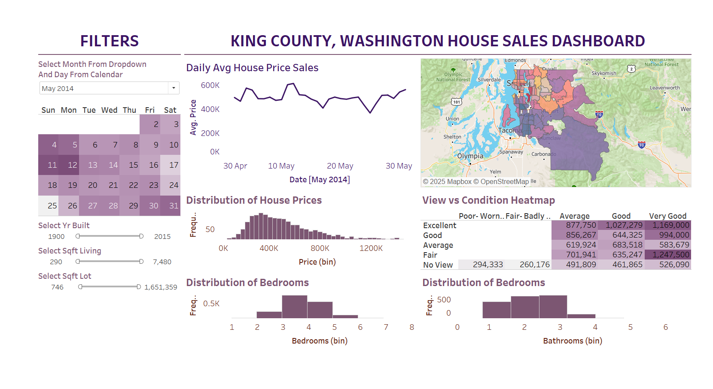

# 🏡 King County House Sales Dashboard

## Project Overview

The **King County House Sales Dashboard** provides an interactive analysis of real estate trends in King County, Washington. It is designed to assist **real estate professionals, analysts, and home buyers** in understanding housing price patterns, property distributions, and key factors influencing property values.

---

## Business Problems Addressed

- **Pricing Trends Analysis** – Tracks **daily average house prices** to identify trends and fluctuations.
- **Geographic Distribution of Sales** – A **map visualization** shows location-based pricing and sales concentration.
- **Property Characteristics Impacting Price** – Analyzes how factors like **bedrooms, bathrooms, and square footage** affect prices.
- **Condition-Based Pricing Strategy** – Examines how **house condition ratings** influence pricing.
- **Market Segmentation** – Categorizes properties based on **year built, lot size, and living area**.
- **Buyer and Seller Insights** – Helps buyers understand **market conditions** and assists sellers in setting **competitive prices**.

---

## Key Features & Visuals

### 1 Filters (Left Panel)

- **Date Selector** – Choose a specific **month and day** to analyze trends.
- **Property Filters** – Adjust **year built, living area (sqft), and lot size** to refine analysis.

### 2 Daily Average House Price Sales (Top Middle)

- **Line chart** tracking **daily average house prices**.
- Identifies **price trends and fluctuations** over time.

### 3 Sales Distribution Map (Top Right)

- Displays **geographical distribution** of house sales.
- **Darker regions** indicate **higher sales volume or price variations**.

### 4 Distribution of House Prices (Middle Left)

- **Histogram** showing the **frequency distribution** of sales within different price ranges.
- Helps understand **common price brackets** in the market.

### 5 View vs. Condition Heatmap (Middle Right)

- Analyzes how **house condition ratings (Poor to Excellent)** affect pricing.
- Higher condition scores result in **higher market value**.

### 6 Distribution of Bedrooms & Bathrooms (Bottom)

- **Histograms** showing the most common property configurations.
- Helps buyers and sellers **understand market demand**.

---

## How to Use This Dashboard?

- **Buyers** – Find **affordable locations** and analyze **pricing trends**.
- **Sellers** – Set **competitive prices** using condition-based pricing insights.
- **Investors** – Identify **high-demand areas** and **investment opportunities**.

---

## Insights & Recommendations

- **High Demand Areas** – Certain locations consistently have **higher prices**, indicating **investment hotspots**.
- **Condition-Based Pricing** – Homes in **"Good" or "Very Good"** condition command **significantly higher prices**.
- **Market Trends** – Seasonal fluctuations in sales prices suggest **timing strategies** for buyers and sellers.
- **Investment Potential** – Older homes with **large lots** may be **prime candidates for renovation and resale**.

---

## Conclusion

The **King County House Sales Dashboard** empowers stakeholders with **data-driven insights** to navigate the real estate market effectively. With **interactive filters and calculated metrics**, this **Tableau dashboard** helps in understanding **market dynamics, optimizing pricing strategies, and making informed investment decisions**.

---
